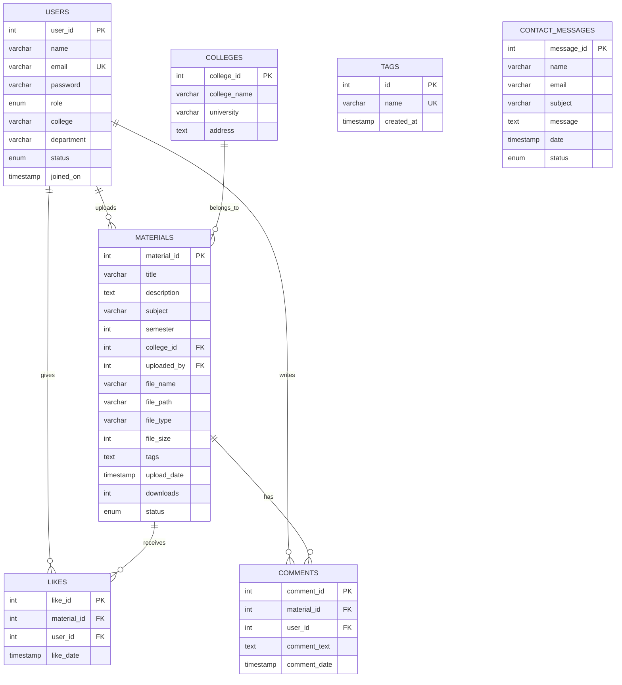

<div align="center">
  
  
  <div>
    
    
    
  </div>
  
  <div style="margin-top: 10px;">
    
    
    
    
  </div>
</div>


<p align="center">
  
  
  
</p>

# 🎓 EduShare - Educational Notes Sharing Platform

## 🚀 Overview

**EduShare** is a full-stack web application that enables seamless sharing of educational materials between students and teachers across different institutions.

### ⚡ Key Features
- 🔐 **User Authentication** - Role-based access (Student/Teacher/Admin)
- 📁 **File Management** - Upload/Download notes with validation
- 🔍 **Advanced Search** - Filter by semester, college, subject, tags
- 👨‍💼 **Admin Panel** - Complete system management
- 💬 **Interactive** - Like/Comment system with engagement tracking
- 📱 **Responsive** - Mobile-friendly dark theme design

---

## 🛠️ Tech Stack

<div align="center">

| Frontend | Backend | Database | Tools |
|----------|---------|----------|-------|
|  |  |  |  |
|  |  |  |  |

</div>

---

## 📂 Project Structure

```
📦 EduShare/
├── 🏠 index.php              # Landing page
├── 📁 auth/                  # Authentication system
│   ├── 📊 dashboard.php      # User dashboard
│   ├── 📤 upload-notes.php   # File upload
│   ├── ⚙️ admin.php          # Admin panel
│   └── 🚪 logout.php         # Session management
├── 📄 pages/                 # Public pages
│   ├── 🔐 login.php          # User login
│   ├── ✍️ register.php       # User registration
│   ├── 🔍 browse.php         # Notes browsing
│   ├── 📋 note-details.php   # Individual note view
│   └── 📞 contact.php        # Contact form
├── 🗄️ db/                    # Database layer
│   └── ⚙️ config.php         # DB configuration
└── 🎨 css/                   # Styling
    └── 🌙 global.css         # Dark theme
```

---

## ⚙️ Core Functionality

### 👤 User Management
- ✅ Registration with role selection
- ✅ Secure authentication system
- ✅ Profile management
- ✅ Role-based permissions

### 📚 Content Management
- ✅ File upload with validation (PDF, DOC, DOCX, TXT, PPT, PPTX)
- ✅ Admin approval workflow
- ✅ Metadata tagging system
- ✅ Download tracking

### 🔍 Search & Discovery
- ✅ Advanced filtering options
- ✅ Pagination for performance
- ✅ Category-based browsing
- ✅ Tag-based organization

### 🛡️ Security Features
- ✅ SQL injection prevention
- ✅ XSS protection
- ✅ File upload security
- ✅ Session management
- ✅ Input validation

---

## 🗄️ Database Design & Architecture

<div align="center">

### Complete Database Schema
| Table | Records | Purpose | Key Relationships |
|-------|---------|---------|------------------|
| `users` | 4 Active Users | Authentication & Profile Management | Primary entity for all user operations |
| `materials` | 2 Approved Notes | Content Storage & Metadata | Links to users and colleges |
| `colleges` | 1 Institution | College Information Management | Referenced by materials and users |
| `tags` | 77 Categories | Content Classification System | Used for material categorization |
| `likes` | 4 Interactions | User Engagement Tracking | Many-to-many: users ↔ materials |
| `comments` | 4 Discussions | Community Feedback System | Threaded discussions on materials |
| `contact_messages` | 1 Support Query | Customer Support Management | Independent support system |

</div>

### 📊 Entity Relationship Diagram



### 🔧 Database Architecture Details

#### Core Tables Structure
- **Users Table**: Role-based authentication with secure password hashing
- **Materials Table**: File metadata with approval workflow (pending → approved/rejected)
- **Colleges Table**: Institution management for proper affiliation
- **Tags Table**: 77 predefined categories for content classification

#### Engagement System
- **Likes Table**: User appreciation system with duplicate prevention
- **Comments Table**: Community discussion threads with timestamp tracking
- **Contact Messages**: Support ticket management system

#### Data Integrity & Performance
- **Foreign Key Constraints**: CASCADE DELETE for referential integrity
- **Unique Constraints**: Email uniqueness, tag name uniqueness
- **Indexed Fields**: Primary keys, foreign keys, email for optimal query performance
- **Normalized Structure**: 3NF compliance eliminating data redundancy

#### Security Implementation
- **Password Security**: PHP `password_hash()` with secure algorithms
- **Input Validation**: Server-side sanitization and type checking
- **File Upload Security**: Type validation and size restrictions (10MB max)
- **SQL Injection Prevention**: Prepared statements throughout the application

---

## 🚀 Installation & Setup

### Prerequisites
```bash
✅ PHP 8.0+
✅ MySQL 8.0+
✅ Apache/Nginx
✅ Modern Browser
```

### Quick Start
```bash
# 1. Clone/Download project
git clone [repository-url]

# 2. Configure database
# Update db/config.php with your credentials

# 3. Import database schema
mysql -u username -p database_name < schema.sql

# 4. Set permissions
chmod 755 uploads/

# 5. Access application
http://localhost/eduShare/
```

---

## 📊 Features Demo

<div align="center">

### 🎓 For Students
Upload Notes → Browse Materials → Download Resources → Engage with Community

### 👨‍🏫 For Teachers  
Share Knowledge → Review Student Content → Build Learning Community

### 👨‍💼 For Admins
Manage Users → Moderate Content → Monitor System → Handle Support

</div>

---

## 🏆 Technical Achievements

<div align="center">

| Achievement | Implementation |
|-------------|----------------|
| 🔧 **Full-Stack Development** | Complete CRUD operations with MVC architecture |
| 🗄️ **Database Design** | Normalized schema with optimized relationships |
| 🛡️ **Security Implementation** | Comprehensive input validation and protection |
| 📱 **Responsive Design** | Mobile-first approach with Bootstrap framework |
| ⚡ **Performance Optimization** | Efficient queries and resource management |
| 🔍 **Advanced Search** | Multi-parameter filtering with pagination |

</div>

---

## 🎯 Key Metrics

<p align="center">
  
  
  
  
</p>

---

## 🔮 Future Enhancements

- 🌐 **Cloud Integration** - AWS S3 storage
- 📱 **Mobile App** - React Native implementation  
- 🤖 **AI Features** - Auto-tagging and recommendations
- 📊 **Analytics** - Advanced usage insights
- 🔔 **Real-time** - Push notifications
- 🎥 **Media Support** - Video content integration

---

## 📈 Impact & Value

### Business Impact
- 📚 **Knowledge Accessibility** - Centralized educational resources
- 🤝 **Community Building** - Cross-institutional collaboration
- ⚡ **Efficiency** - Streamlined content sharing process
- 🎯 **Quality Control** - Admin-moderated content system

### Technical Skills Demonstrated
- 🔧 **Full-Stack Development** - End-to-end application building
- 🗄️ **Database Architecture** - Relational database design
- 🛡️ **Security Engineering** - Comprehensive protection implementation
- 🎨 **UI/UX Design** - User-centered interface development
- 📊 **System Design** - Scalable architecture planning

---

## 👨‍💻 Developer Information

<div align="center">
  
  
  <p><em>Computer Science Student & Aspiring Software Developer</em></p>
  
  <div style="margin: 20px 0;">
    <a href="https://lucky-longre.onrender.com/">
      
    </a>
    <a href="mailto:officialluckylongre@gmail.com">
      
    </a>
    <a href="https://www.linkedin.com/in/lucky-longre/">
      
    </a>
  </div>
  
  <p>
    
    
    
  </p>
</div>

### 🎯 Professional Profile

**Lucky Longre** is a dedicated Computer Science student and aspiring full-stack developer with a passion for creating innovative web solutions that solve real-world problems. Currently pursuing advanced studies in software development, Lucky combines academic knowledge with practical implementation skills.

### 💼 Technical Expertise

<div align="center">

| **Frontend Technologies** | **Backend Technologies** | **Database & Tools** |
|--------------------------|-------------------------|---------------------|
| HTML5, CSS3, JavaScript | PHP, Node.js | MySQL, MongoDB |
| React.js, Bootstrap | Express.js, RESTful APIs | Git, GitHub |
| Responsive Design | Authentication Systems | phpMyAdmin, Postman |
| jQuery, AJAX | File Upload Systems | VS Code, XAMPP |

</div>

### 🚀 Development Philosophy

- **Problem-Solving First**: Every project starts with understanding the real-world problem
- **User-Centric Design**: Building intuitive interfaces that enhance user experience
- **Security-Minded**: Implementing robust security measures from the ground up
- **Performance Focused**: Optimizing applications for speed and scalability
- **Continuous Learning**: Staying updated with latest technologies and best practices

### 🏆 Project Highlights

- **EduShare Platform**: Full-stack educational resource sharing application
- **Database Architecture**: Designed normalized schemas with optimized relationships
- **Security Implementation**: Comprehensive protection against common vulnerabilities
- **Responsive Design**: Mobile-first approach with modern UI/UX principles

### 📈 Academic & Professional Goals

- **Short-term**: Complete Computer Science degree with distinction
- **Medium-term**: Secure full-stack developer position in innovative tech company
- **Long-term**: Lead development teams and architect scalable software solutions
- **Vision**: Contribute to educational technology that makes learning accessible globally

---

<div align="center">
  
  
  <h3>🎓 EduShare - Empowering Education Through Technology</h3>
  
  <p><em>A production-ready full-stack web application demonstrating advanced development skills and real-world problem-solving capabilities.</em></p>
  
  <div>
    
    
    
  </div>
  
  <p><strong>Developed by Lucky Longre</strong></p>
</div>
