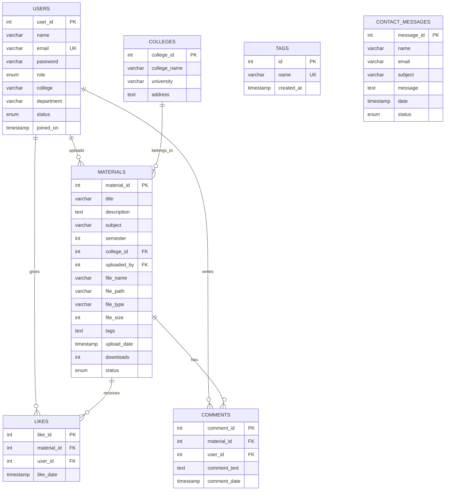

<div align="center">
  
  
  <div>
    
    
    
  </div>
  
  <div style="margin-top: 15px;">
    
    
    
    
  </div>
</div>


<p align="center">
  
  
  
</p>

# 🎓 EduShare - Educational Notes Sharing Platform
### *College Practical Project Presentation*

---

## 📋 Project Overview

<div align="center">
  
</div>

**EduShare** addresses the critical problem of limited access to quality educational materials in academic institutions. This full-stack web application creates a centralized platform where students and teachers can seamlessly share, discover, and access study materials.

### 🔍 Problem Identified
- Students struggle to find quality notes and study materials
- Limited sharing mechanisms between different colleges and departments  
- Lack of organized, searchable educational resource repository
- No quality control system for shared materials

### 💡 Solution Implemented
- **Centralized Platform** - Single repository for all educational materials
- **Role-Based Access** - Students, Teachers, and Admin functionalities
- **Quality Control** - Admin approval system for uploaded content
- **Advanced Search** - Multi-parameter filtering and discovery
- **Community Features** - Like, comment, and engagement systems

---

## 🏗️ System Architecture & Design

<div align="center">

### Technology Stack
| Layer | Technology | Purpose |
|-------|------------|---------|
| **Frontend** | HTML5, CSS3, JavaScript | User Interface & Interaction |
| **Framework** | Bootstrap 5.3.2 | Responsive Design & Components |
| **Backend** | PHP 8.x | Server-side Logic & Processing |
| **Database** | MySQL 8.x | Data Storage & Management |
| **Additional** | jQuery, Select2, FontAwesome | Enhanced User Experience |

</div>

### 📁 Project Structure
```
📦 EduShare Project
├── 🏠 index.php                 # Homepage & Landing
├── 🔐 Authentication System
│   ├── 📊 dashboard.php         # User Dashboard
│   ├── 📤 upload-notes.php      # File Upload System
│   ├── ⚙️ admin.php             # Administrative Panel
│   └── 🚪 logout.php            # Session Management
├── 📄 User Pages
│   ├── 🔑 login.php             # User Authentication
│   ├── ✍️ register.php          # Account Creation
│   ├── 🔍 browse.php            # Notes Discovery
│   ├── 📋 note-details.php      # Individual Note View
│   └── 📞 contact.php           # Support System
├── 🗄️ Database Layer
│   └── ⚙️ config.php            # Database Configuration
└── 🎨 Styling
    └── 🌙 global.css            # Custom Dark Theme
```

---

## ⚡ Core Features Demonstration

### 🔐 User Management System
<div align="center">
  
  
  
</div>

- **Student Registration** - Account creation with college details
- **Teacher Registration** - Educator account with institutional affiliation
- **Admin Panel Access** - System administration capabilities
- **Session Management** - Secure login/logout functionality

### 📚 Content Management System
<div align="center">
  
  
  
</div>

- **File Upload** - Support for PDF, DOC, DOCX, TXT, PPT, PPTX (up to 10MB)
- **Metadata Collection** - Title, description, subject, semester, tags
- **Admin Approval** - Quality control before publication
- **Download Tracking** - Usage statistics and analytics

### 🔍 Advanced Search & Discovery
<div align="center">
  
  
  
</div>

- **Keyword Search** - Title, description, subject-based discovery
- **Advanced Filters** - Semester, college, tag-based filtering
- **Responsive Results** - Card-based layout with pagination
- **Real-time Filtering** - Dynamic search without page reload

### 💬 Community Engagement
<div align="center">
  
  
  
</div>

- **Like System** - User appreciation for helpful content
- **Comment Threads** - Discussion and feedback mechanism
- **Share Functionality** - Easy link sharing for notes
- **Role Badges** - Visual identification of user types

---

## 🗄️ Database Design & Implementation

<div align="center">

### Database Schema Overview
| Table | Records | Purpose |
|-------|---------|---------|
| `users` | 4 Active Users | Authentication & Profile Management |
| `materials` | 2 Approved Notes | Content Storage & Metadata |
| `colleges` | 1 Institution | College Information Management |
| `tags` | 77 Categories | Content Classification System |
| `likes` | 4 Interactions | User Engagement Tracking |
| `comments` | 4 Discussions | Community Feedback System |
| `contact_messages` | 1 Support Query | Customer Support Management |

</div>

### 📊 Database Entity Relationship Diagram



### 🔗 Database Schema Details

#### 👥 Users Table
- **Primary Key**: `user_id` (Auto-increment)
- **Unique Constraints**: `email` (Prevents duplicate accounts)
- **Roles**: Student, Teacher, Admin (Role-based access control)
- **Status**: Active/Inactive (Account management)
- **Security**: Password hashing with PHP `password_hash()`

#### 📚 Materials Table  
- **Primary Key**: `material_id` (Auto-increment)
- **Foreign Keys**: 
  - `uploaded_by` → `users.user_id` (CASCADE DELETE)
  - `college_id` → `colleges.college_id` (CASCADE DELETE)
- **File Support**: PDF, DOC, DOCX, TXT, PPT, PPTX (Max 10MB)
- **Status Flow**: Pending → Approved/Rejected (Admin moderation)
- **Metadata**: Title, description, subject, semester, tags

#### 🏫 Colleges Table
- **Primary Key**: `college_id` (Auto-increment)  
- **Purpose**: Institution management and affiliation
- **Fields**: College name, university, address details

#### 🏷️ Tags Table
- **Primary Key**: `id` (Auto-increment)
- **Unique Constraints**: `name` (Prevents duplicate tags)
- **Categories**: 77 predefined tags for content classification
- **Usage**: Subject areas, document types, academic levels

#### 💖 Likes Table
- **Primary Key**: `like_id` (Auto-increment)
- **Composite Unique**: (`material_id`, `user_id`) - Prevents duplicate likes
- **Foreign Keys**: Both CASCADE DELETE for data integrity
- **Tracking**: User engagement and content popularity

#### 💬 Comments Table
- **Primary Key**: `comment_id` (Auto-increment)
- **Foreign Keys**: CASCADE DELETE maintains referential integrity
- **Features**: Threaded discussions, timestamp tracking
- **Moderation**: Real-time community feedback system

#### 📧 Contact Messages Table
- **Primary Key**: `message_id` (Auto-increment)
- **Status**: Unread/Read (Support ticket management)
- **Purpose**: User inquiries and support system

### 🔗 Relationships & Integrity

#### Foreign Key Constraints
- **Users → Materials**: One-to-Many (User can upload multiple files)
- **Colleges → Materials**: One-to-Many (College has multiple materials)  
- **Materials → Likes**: One-to-Many (Material can have multiple likes)
- **Materials → Comments**: One-to-Many (Material can have multiple comments)
- **Users → Likes**: One-to-Many (User can like multiple materials)
- **Users → Comments**: One-to-Many (User can comment on multiple materials)

#### Database Optimization
- **Indexed Fields**: Primary keys, foreign keys, email (Faster queries)
- **Normalized Structure**: 3NF compliance (Eliminates redundancy)
- **Cascade Operations**: Automatic cleanup on record deletion
- **Data Validation**: Server-side input sanitization and type checking
- **Unique Constraints**: Prevents duplicate users and tags

---

## 🛡️ Security Implementation

<div align="center">
  
  
  
</div>

### Security Measures Implemented
- ✅ **Password Security** - PHP password_hash() with secure algorithms
- ✅ **SQL Injection Prevention** - Prepared statements throughout
- ✅ **XSS Protection** - Input sanitization and output escaping
- ✅ **File Upload Security** - Type validation and size restrictions
- ✅ **Session Security** - Secure session management and regeneration
- ✅ **CSRF Protection** - Form token validation

---

## 📱 User Interface & Experience

<div align="center">
  
  
  
</div>

### Design Principles
- **Dark Theme** - Modern, professional appearance reducing eye strain
- **Responsive Layout** - Seamless experience across all devices
- **Intuitive Navigation** - Clear menu structure and user flows
- **Loading States** - Progress indicators for better user feedback
- **Error Handling** - User-friendly error messages and validation

---

## 🚀 Live Demonstration Flow

### 👨‍🎓 Student Journey
1. **Registration** → Create account with college details
2. **Login** → Access personalized dashboard
3. **Upload Notes** → Share study materials (pending approval)
4. **Browse Content** → Discover notes from other users
5. **Engage** → Like, comment, and download materials

### 👨‍🏫 Teacher Journey
1. **Registration** → Create educator account
2. **Content Sharing** → Upload course materials and resources
3. **Community Engagement** → Review and comment on student uploads
4. **Knowledge Distribution** → Share expertise across institutions

### 👨‍💼 Admin Journey
1. **System Overview** → Monitor platform statistics
2. **Content Moderation** → Review and approve/reject uploads
3. **User Management** → Handle user accounts and permissions
4. **Support Handling** → Manage contact form submissions

---

## 📊 Project Achievements & Learning Outcomes

<div align="center">

### Technical Skills Demonstrated
| Skill Category | Implementation |
|----------------|----------------|
| **Full-Stack Development** | Complete CRUD application with frontend and backend |
| **Database Design** | Normalized schema with optimized relationships |
| **Security Engineering** | Comprehensive protection against common vulnerabilities |
| **UI/UX Design** | User-centered design with accessibility considerations |
| **System Architecture** | Scalable, maintainable code structure |
| **Problem Solving** | Real-world educational challenge addressed |

</div>

### 🎯 Key Accomplishments
- ✅ **Functional Web Application** - Complete working system
- ✅ **User Management** - Authentication and authorization
- ✅ **File Handling** - Secure upload and download system
- ✅ **Database Operations** - Complex queries and relationships
- ✅ **Responsive Design** - Mobile-friendly interface
- ✅ **Security Implementation** - Protection against common attacks
- ✅ **Admin Panel** - Complete system management interface

---

## 🔮 Future Enhancements & Scalability

<div align="center">
  
  
  
  
</div>

### Planned Improvements
- **Cloud Storage** - AWS S3 integration for better file management
- **Real-time Features** - Push notifications and live updates
- **Mobile Application** - Native mobile app development
- **AI Integration** - Automatic content tagging and recommendations
- **Advanced Analytics** - Detailed usage reports and insights
- **Video Support** - Educational video content sharing

---

## 👨‍💻 Developer Information

<div align="center">
  
  
  <p><em>Computer Science Student & Aspiring Software Developer</em></p>
  
  <div style="margin: 20px 0;">
    <a href="https://lucky-longre.onrender.com/">
      
    </a>
    <a href="mailto:officialluckylongre@gmail.com">
      
    </a>
    <a href="https://www.linkedin.com/in/lucky-longre/">
      
    </a>
  </div>
  
  <p>
    
    
    
  </p>
</div>

---

## 🏆 Project Impact & Conclusion

<div align="center">
  
  
  
</div>

### Project Significance
- **Educational Value** - Addresses real academic challenges
- **Technical Proficiency** - Demonstrates comprehensive development skills
- **Problem-Solving** - Practical solution to resource accessibility
- **Community Impact** - Facilitates knowledge sharing across institutions
- **Professional Readiness** - Industry-standard development practices

### Learning Outcomes
- **Full-Stack Development** - End-to-end application building
- **Database Management** - Complex data relationships and optimization
- **Security Awareness** - Implementation of protection measures
- **User Experience Design** - Creating intuitive, accessible interfaces
- **Project Management** - Planning, development, and deployment cycle

---

<div align="center">
  
  
  <h2>🎓 Thank You for Your Attention!</h2>
  
  <p><em>EduShare - Empowering Education Through Technology</em></p>
  
  <div>
    
    
  </div>
  
  <p style="margin-top: 20px;"><strong>Questions & Discussion Welcome!</strong></p>
  
  <div style="margin-top: 15px;">
    
    
  </div>
</div>
